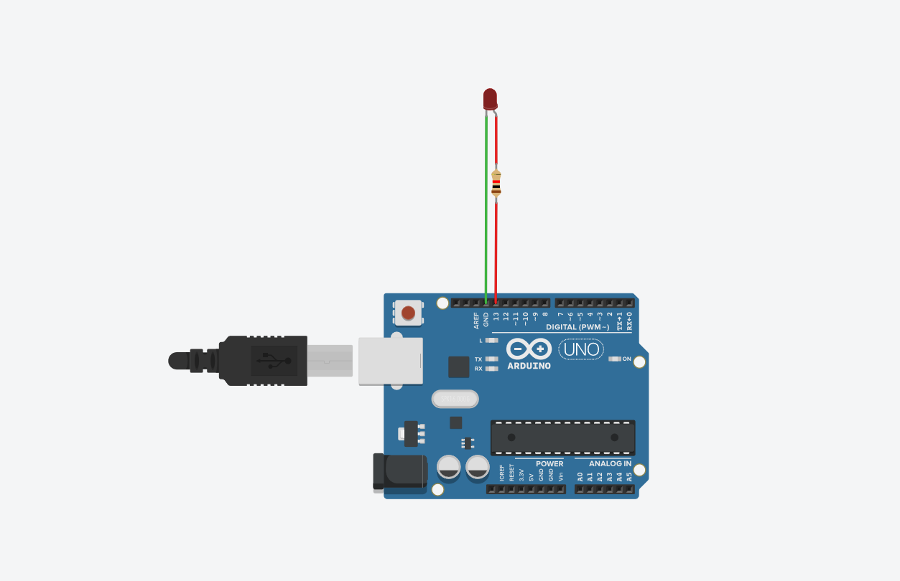
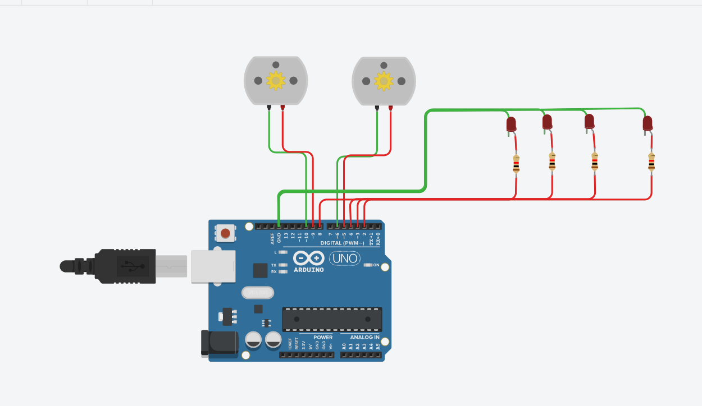
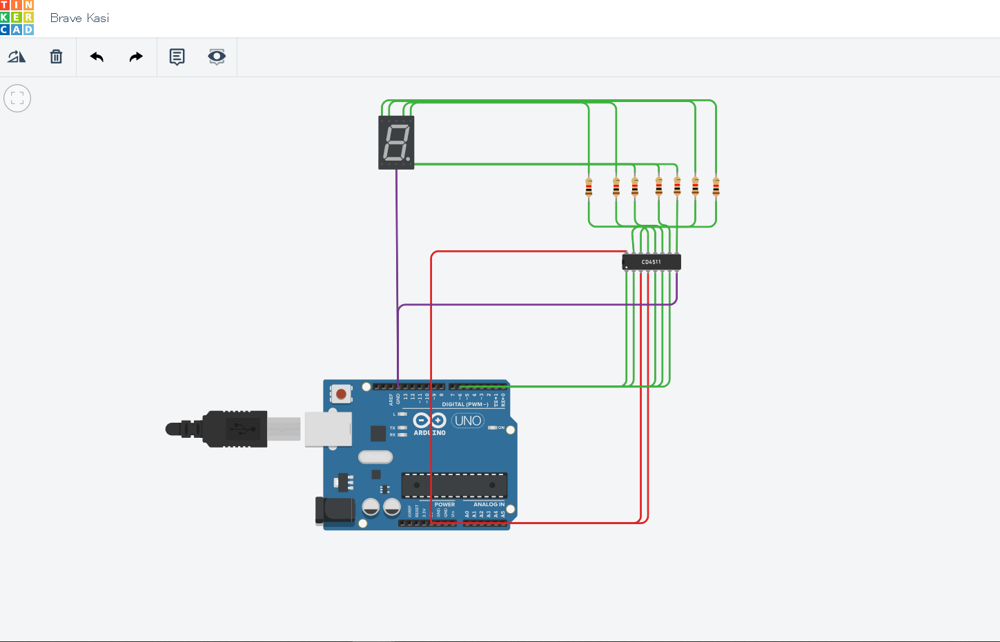

# 开源硬件实战课程

| 日期 | 内容                 | 作业                                                   |
| ---- | -------------------- | ------------------------------------------------------ |
| 0702 | 入门                 | 创建github账号,安装arduino,fritzing,processing         |
| 0703 | arduino编程          | morse代码,库函数形式                                   |
| 0704 | 认识电子元件及其操作 | 1,小车代码和电路图2,数码管代码和电路图                 |
| 0705 | 总结                 | 1,莫尔斯代码thinkercad可运行代码;2markdown格式学习总结 |

## 第一天入门介绍

- 为什么要学习开源硬件

- 如何学习开源硬件

- 几个常用软件

##  第二天软件操作

- Arduino安装

- Arduino文档

- Arduino基本操作

- Arduino类库操作

https://github.com/QThh/7.3-7.6-work/blob/master/0703/morse

https://github.com/QThh/7.3-7.6-work/blob/master/0703/morse.cpp

https://github.com/QThh/7.3-7.6-work/blob/master/0703/morse.h

## 第三天元器件及电路图

- 使用在线模拟网站

- 小车电路及代码

- 7位译码器使用

- CD4511IC使用

https://github.com/QThh/7.3-7.6-work/blob/master/0704/dianji-led

https://github.com/QThh/7.3-7.6-work/blob/master/0704homework/7.4work

##  第四天morse代码thinkercad可运行代码

https://github.com/QThh/7.3-7.5-work/blob/master/7.5/morse